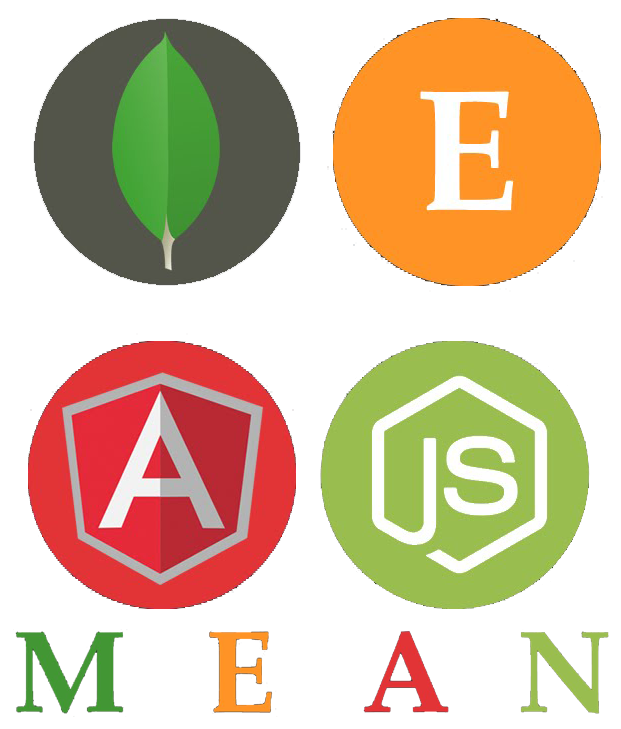
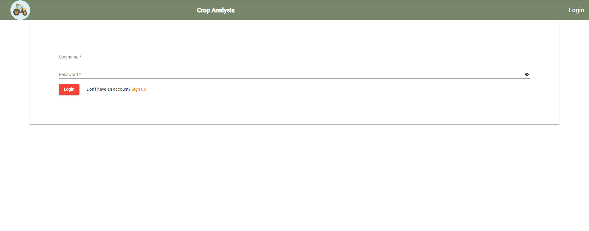
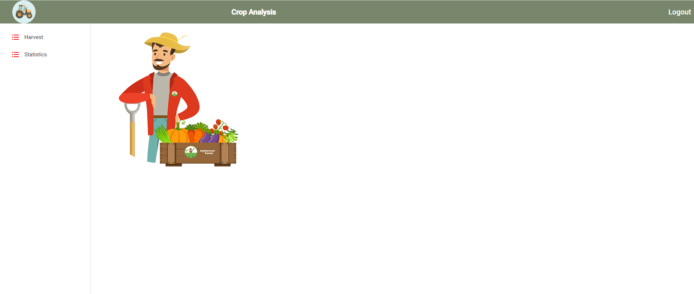
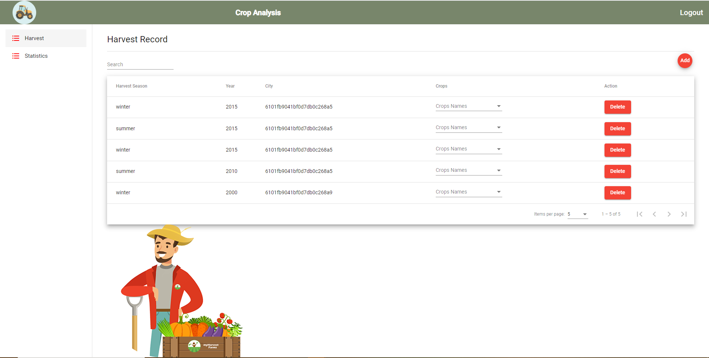
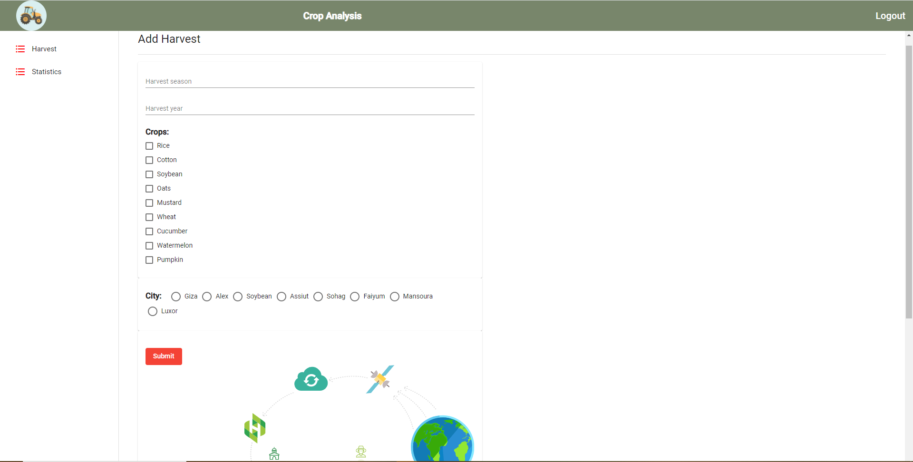

# MEAN Stack Crop Analysis

This project was generated with [Angular CLI](https://github.com/angular/angular-cli) version 11.2.2.

## Stack of technologies

* [Mongo DB](https://www.mongodb.org/);
* [Express JS](http://expressjs.com/);
* [Angular JS](https://angularjs.org/);
* [Node JS](https://nodejs.org/);

Other tools and technologies used:
* [Angular CLI](https://cli.angular.io): frontend scaffolding
* [Angular Material](https://material.angular.io/): material design components
* [JSON Web Token](https://jwt.io): user authentication
* [Bcrypt.js](https://github.com/dcodeIO/bcrypt.js): password encryption

## Running Locally

Make sure you have [Node.js](http://nodejs.org/) installed.

### Running Front end
 In root directory
 npm install
 ng serve
 ### Running back end
  cd server
  npm install
  nodemon app.js

## Prerequisites
1. Install [Node.js](https://nodejs.org) and [MongoDB](https://www.mongodb.com)
2. Install Angular CLI: `npm i -g @angular/cli`
3. From project root folder install all the dependencies: `npm i`

### Preview 

  
  
  
  

